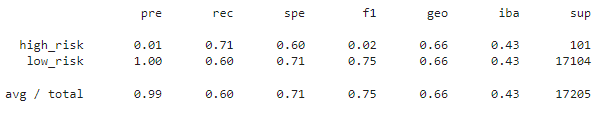
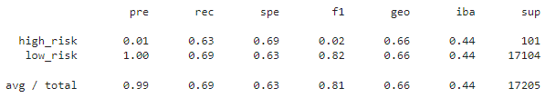
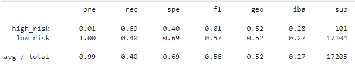
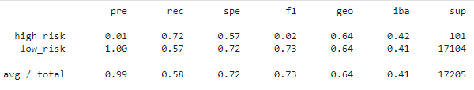
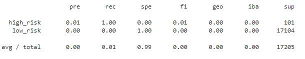
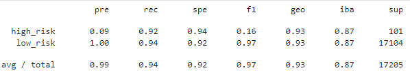

# Credit_Risk_Analysis

## Overview
We used 6 different imbalanced classifiers to help make the classifications to see which would work best to classify loan applicants as high risk or low risk. The reason that we use imbalanced classifiers is because the dataset consists of far more low risk applicants than high risk. The classifiers we used were:

* Naive Random Oversampling

* SMOTE Oversampling

* Undersampling

* Combination (Over and Under) Sampling

* Balanced Random Forest Classifier

* Easy Ensemble AdaBoost Classifier

## Results

### Naive Random Oversampling

* accuracy score: 0.6579148297196418

* precision score: (high risk: 0.01)(low risk: 1.00)(avg/total: 0.99) 

* recall score: (high risk: 0.71)(low risk: 0.60)(avg/total: 0.60) 

### SMOTE Oversampling

* accuracy score: 0.662861851549982

* precision score: (high risk: 0.01)(low risk: 1.00)(avg/total: 0.99) 

* recall score: (high risk: 0.63)(low risk: 0.69)(avg/total: 0.69) 

### Undersampling

* accuracy score: 0.5442661782548694

* precision score: (high risk: 0.01)(low risk: 1.00)(avg/total: 0.99) 

* recall score: (high risk: 0.69)(low risk: 0.40)(avg/total: 0.40) 

### Combination (Over and Under) Sampling

* accuracy score: 0.6488335193435153

* precision score: (high risk: 0.01)(low risk: 1.00)(avg/total: 0.99) 

* recall score: (high risk: 0.72)(low risk: 0.57)(avg/total: 0.58) 

### Balanced Random Forest Classifier

* accuracy score: 0.7887512850910909

* precision score: (high risk: 0.01)(low risk: 0.00)(avg/total: 0.00) 

* recall score: (high risk: 1.00)(low risk: 0.00)(avg/total: 0.01) 

### Easy Ensemble AdaBoost Classifier

* accuracy score: 0.931601605553446

* precision score: (high risk: 0.09)(low risk: 1.00)(avg/total: 0.99) 

* recall score: (high risk: 0.92)(low risk: 0.94)(avg/total: 0.94) 

## Summary
Most of the classifiers seem to be have a relatively unsatisfactory accuracy other than the Easy Ensemble AdaBoost Classifier. Though it has a low precision score for high risk, the precision is still higher than all of the other  options. The recall scores are all higher than the other options as well.

When looking at which model would be the most effective for this dataset, the best choice would be the Easy Ensemble AdaBoost Classifier since it outperformed the other options in almost all aspects.
